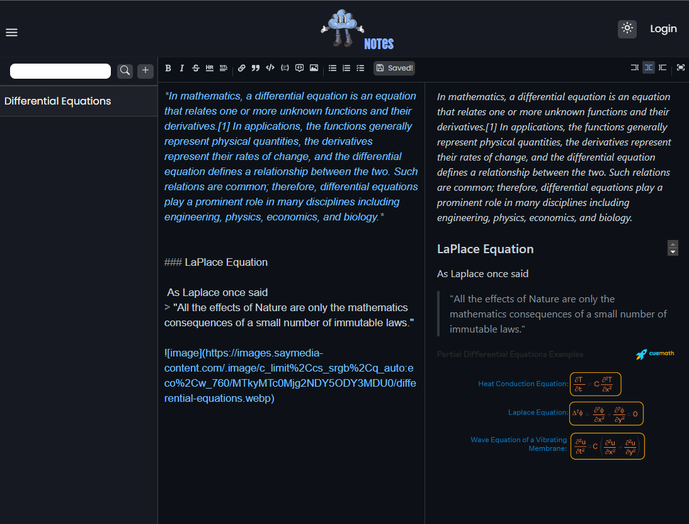

## Note app

wip


# Notes

An dekstop and web application made with Tauri, NodeJS and TypeScript, with a lot of features like Markdown syntax in the notes. In the front-end it uses React aside with Redux and in the back-end it uses NodeJS aside with frameworks like ExpressJS. As usual, the autheticantion workflow generate a JWT token to store in session cookie of the current user. 



## Author

* Marcos Bezerra Campos 
* **Email:** marcos.b.campos14@gmail.com
* **Linkedin:** https://www.linkedin.com/in/marcos-bezerra-campos-981927196/
## Dependencies

- @reduxjs/toolkit: ^1.9.5,
- @tauri-apps/api: ^1.4.0,
- @uiw/react-md-editor: ^3.23.4,
- axios: ^1.4.0,
- dotenv: ^16.3.1,
- react: ^18.2.0,
- react-dom: ^18.2.0,
- react-icons: ^4.10.1,
- react-markdown: ^8.0.7,
- react-redux: ^8.1.2,
- react-router-dom: ^6.14.2,
- redux: ^4.2.1,
- redux-thunk: ^2.4.2,
- rehype-sanitize: ^5.0.1
- yarn or npm

## Setting up 

```bash
$ git clone https://github.com/marcos-c1/notes 
$ cd notes 
$ cd backend && yarn install && yarn run dev
```
The command **yarn tauri dev** is for desktop application and **yarn run dev** is for web application.

```bash
$ cd frontend && yarn tauri dev (desktop)
$ cd frontend && yarn run dev (web)
```